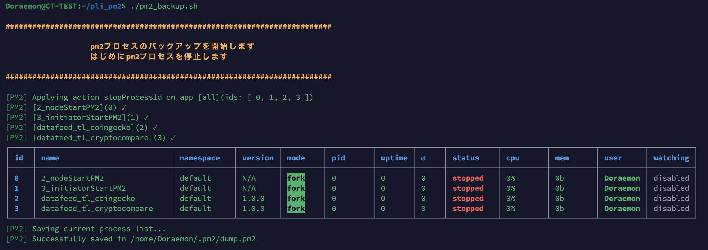
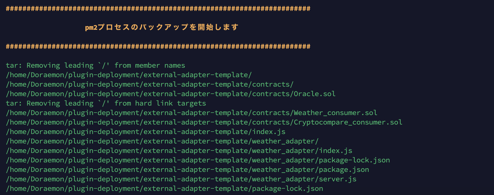
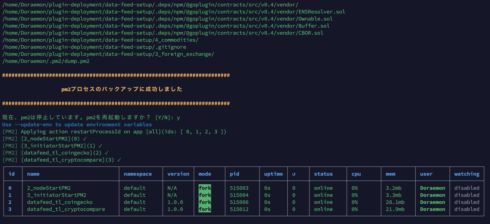
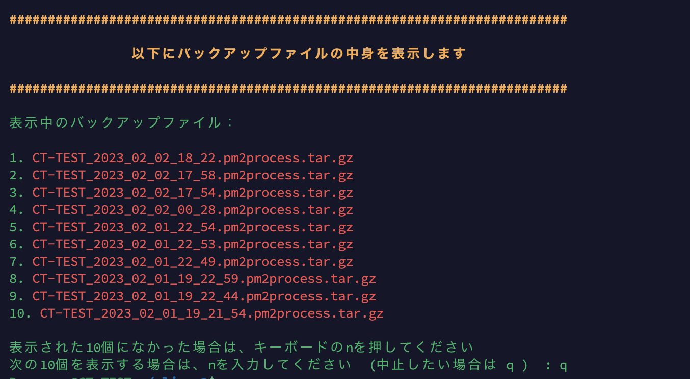
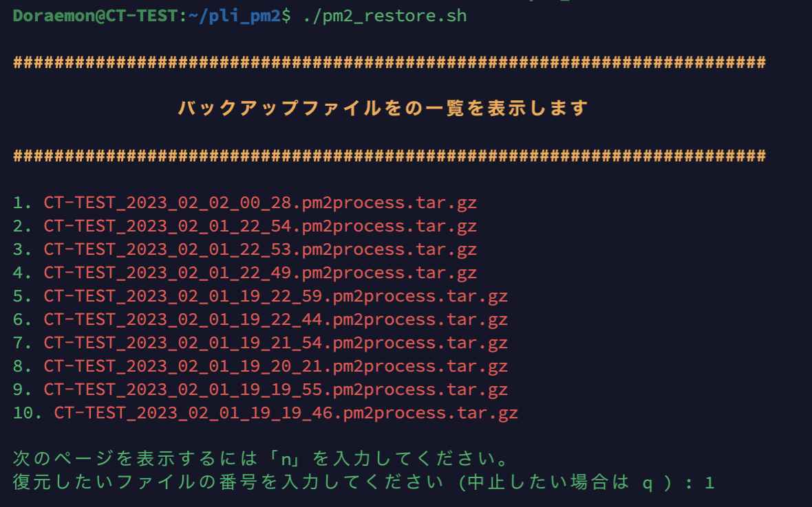
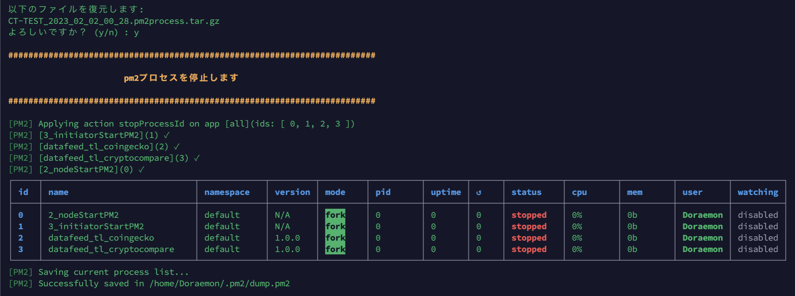
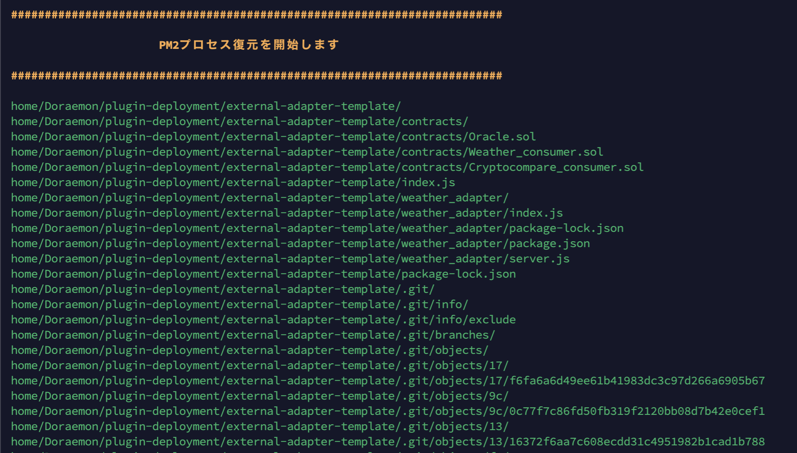
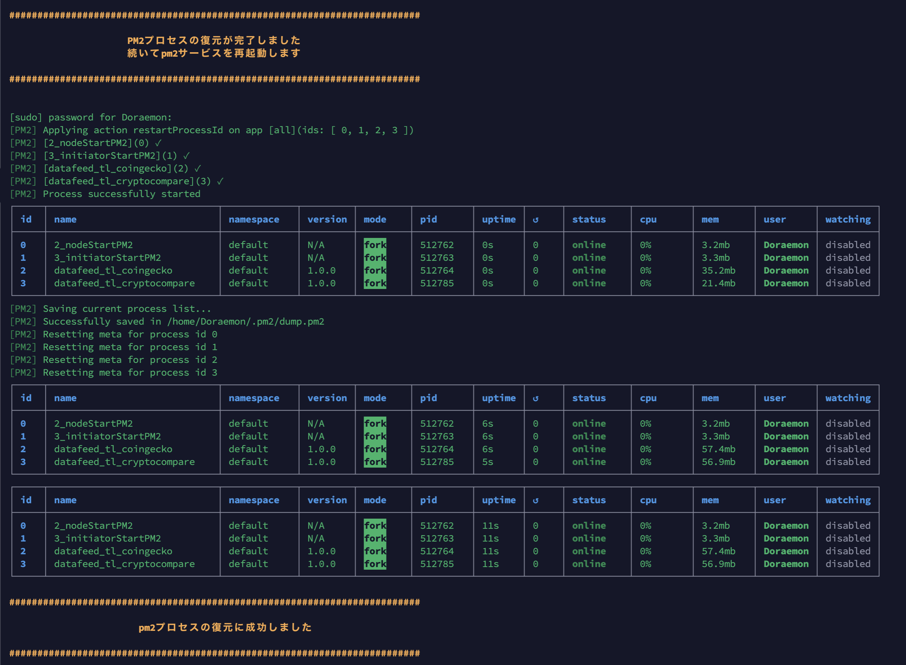

# Backup and Restore PM2 PROCESSes

PluginNode内にある、以下のディレクトリとファイルをバックアップします。

* external-adapter-template/
* data-feed-setup/
* external-adapter-feeds/
* dump.pm2

上記ディレクトリとファイルは、以下の場所にあるものとする。

```
    ~/plugin-deployment/
    │   ├── data-feed-setup/
    │   ├── external-adapter-feeds/
    │   └── external-adapter-template/
    ~/.pm2/
        └── dump.pm2
```

---

**Backup of conf and db**

`Conf files`と`Database files`は、先にバックアップをしておくことをお勧めします。
```sh
cd ~/plugin-deployment && ./_plinode_setup_bkup.sh && ./_plinode_backup.sh -full
```

---

# Backup of PM2 PROCESSes

## 1． githubからダウンロード

```sh
cd $HOME
git clone https://github.com/11ppm/pli_pm2/blob/main/pm2process_restore.sh
cd pli_pm2
chmod +x *.sh
```


## 2． バックアップの実行

```sh
./pm2process_backup.sh 
```


* 上記のディレクトリとファイルを`/plinode_backups`にバックアップします
* バックアップファイルは、ホスト名と日時も含めたファイル名になり、`pm2process.tar.gz`の形式になります
* ノードにセットしてあるディレクトリのみバックアップします


#### 2-1  pm2プロセス停止
実行すると、はじめにpm2プロセスを停止します。



#### 2-2  バックアップ開始
次にpm2プロセスのバックアップが始まります。



#### 2-3  pm2再起動
バックアップが終わると、pm2プロセスを再起動するかどうかを尋ねられます。再起動する場合は`Y(y)`してください。再起動がはじまります。しない場合は`N(n)`を入力して終了します。


#### 2-4  ファイル確認
バックアップが成功すると、成功したという表示が出ます。そのまま`/plinode_backups`ディレクトリの中にあるバックアップしたファイルの一覧が表示されますので、バックアップファイルを確認することができます。



# Rstore of PM2 PROCESSes

## 3． 復元の実行
```shell
./pm2process_restore.sh
```

* 実行すると、`/plinode_backups`にあるバックアップファイルの一覧を10件ずつ表示します。復元したい番号を選択します

* 復元したいファイルが表示された一覧にない場合は、`n`を押して次のページに進んでください。復元したい`pm2process`ファイルが見つかったら、番号を入力します

* 一覧には`conf`ファイルと`db`ファイルも表示するようにしてありますが、選択できません。こちらのファイルを復元したい場合は、以下のサイト [GoPlugin 公式サイト](https://github.com/GoPlugin/plugin-deployment/blob/main/docs/node_backup_restore.md)を参照してください


* 番号を選択すると確認がありますので、実行する場合は`y`、中止する場合は`q`を入力してください。 `y`を入力すると、復元がはじまります。

#### 3-1  一覧表示
バックアップファイルの一覧を10件ずつ表示します。


#### 3-2  pm2プロセス停止
復元がはじまると、まずpm2プロセスをすべて停止します。


#### 3-3  復元開始
バックアップファイルの復元を開始します。


復元するディレクトリとファイルは、以下の通りです。バックアップされたディレクトリとファイルのみが復元されます。

* external-adapter-template/
* data-feed-setup
* external-adapter-feeds
* dump.pm2

復元先は、以下の通りです。
```
    ~/plugin-deployment/
    │   ├── data-feed-setup/
    │   ├── external-adapter-feeds/
    │   └── external-adapter-template/
    ~/.pm2/
        └── dump.pm2
```


#### 3-4  pm2s再起動
復元が完了すると、pm2サービスを再起動し、pm2プロセスを再起動します。


最後にpm2プロセスの`↺`の数字が増えていないことを確認してください。

# Author

* @11ppm


